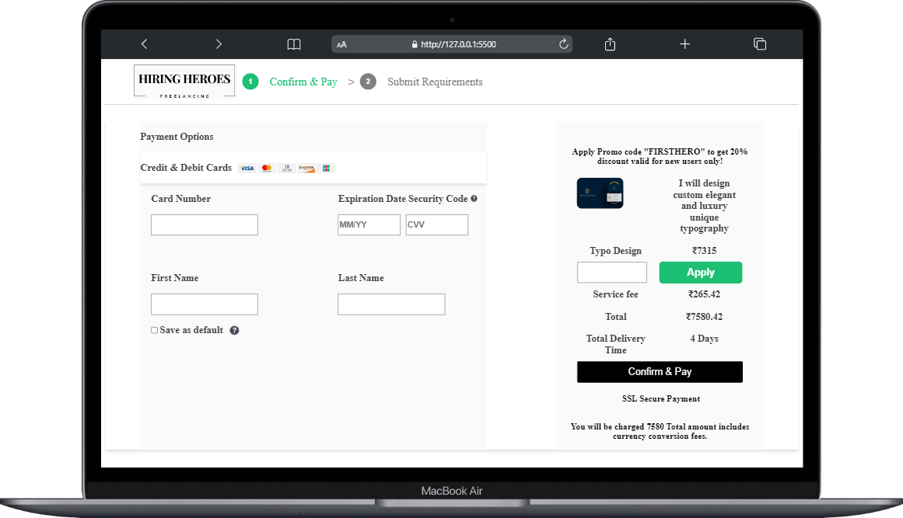
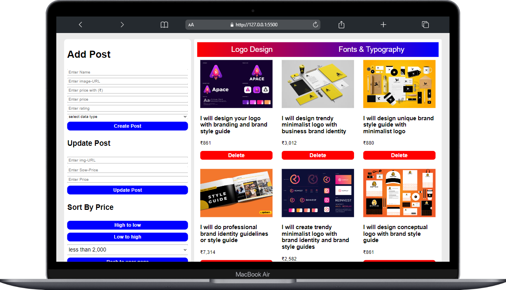

# About

Styluxe is an one-stop-shop for all your shopping needs. With a vast collection of products of fashion and clothing, we offer a seamless shopping experience. Our user-friendly interface and secure payment options ensure a hassle-free shopping experience for our customers. Shop with us today and discover the convenience of online shopping!

# Homepage 

<table>
  <tr>
    <td valign="top"></td>

  <!-- <td valign="top"></td> -->
  </tr>
</table>

# Product Page
 

<table>
  <tr>
    <td valign="top"></td>
    <!-- <td valign="top"></td> -->
  </tr>
</table>

# Cart Page

<table>
  <tr>
    <td valign="top"></td>
    <!-- <td valign="top"></td> -->
  </tr>
</table>

# Checkout Page

<table>
  <tr>
    <td valign="top"></td>
    <!-- <td valign="top"></td> -->
  </tr>
</table>

# Admin Panel : Dashboard

<table>
  <tr>
    <td valign="top"></td>
    <!-- <td valign="top"></td> -->
  </tr>
</table>
  
# Tech Stack

# Front-End

- HTML
- CSS
- JavaScript 
  

# Folder Structure and Packages

==>Before you start:

- I have already created all the folders which you will need during journey.

- Dont use any other folder to make files if you are doing please inform the
  team members that you have created a folder with name. 

=> Clone the directory to start work `$git clone https://github.com/Tushit99/HiringHeroes-Fiverr-Clone-.git`

=> Some basic requirements(Mandatory):
1- You have to work in daily branches manner, so you have to create
new branch everyday . So you have make branch using your student_code
followed the day in which you working. below is the eg for my branches.

  - branch-naming style: fw21_XXXX_day-x

  -for day-2 branch name should be: fw21_1003_day-2
  -for day-3 branch name should be: fw21_1003_day-3
  -for day-4 branch name should be: fw21_1003_day-4
  -for day-5 branch name should be: fw21_1003_day-5

  2- How to create branches:
      - $git branch <branch-name> (without angle brackets)

  3- How to switch branches:
      -$git switch <branch-name>  (without angle brackets)

  4- How to pull:
      -$git pull origin <branch-name>    (without angle brackets)
 
